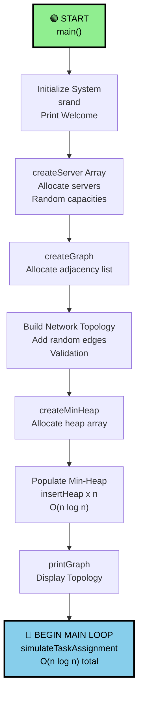
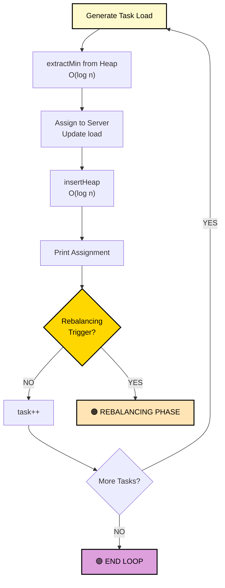
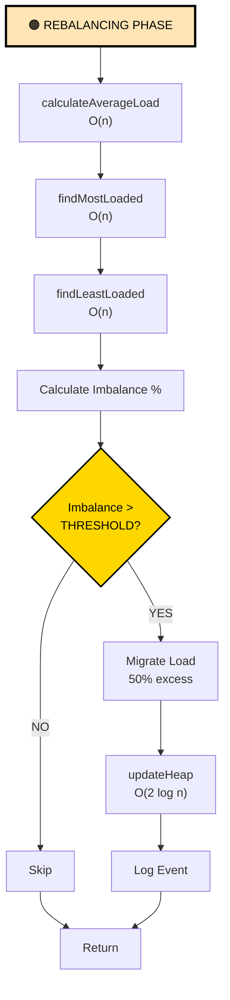
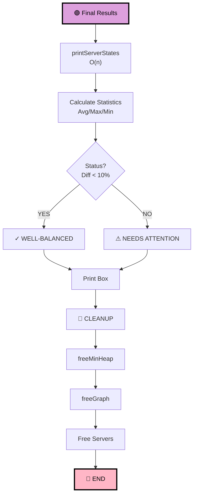

# 🚀 Dynamic Load Balancer in C

<div align="center">


**A production-quality C implementation of a dynamic load balancing system for distributed computing environments.**

[⭐ Features](#-features) • [📊 Architecture](#-architecture-overview) • [🔧 Functions](#-function-reference) • [📈 Examples](#-example-output) • [🚀 Quick Start](#-quick-start)

</div>

---

## 📌 Overview

This project implements a **distributed system load balancing simulator** that dynamically distributes computational tasks across multiple interconnected servers. The system uses advanced data structures (min-heap, graph adjacency lists) and algorithms to achieve optimal load distribution with O(n log n) time complexity.

### 🎯 Core Capabilities

| Feature | Description | Complexity |
|---------|-------------|-----------|
| **Min-Heap Task Assignment** | Selects least-loaded server for each task | O(log n) |
| **Dynamic Rebalancing** | Automatically migrates load when imbalance detected | O(n) |
| **Network Topology** | Maintains server connectivity via graph structure | O(V+E) |
| **Real-time Monitoring** | Continuous load tracking and statistics | O(n) |
| **Memory Management** | Efficient cleanup and deallocation | O(V+E) |

---

## ✨ Features

### 🔵 Core Algorithm Features
- ✅ **Min-Heap Priority Queue** - O(log n) server selection for task assignment
- ✅ **Graph-Based Network** - Adjacency list topology with validation
- ✅ **Dynamic Rebalancing** - Automatic load migration when thresholds exceeded
- ✅ **Real-time Statistics** - Load monitoring and system balance assessment
- ✅ **Comprehensive Logging** - Detailed task assignment and rebalancing logs

### 🟢 System Capabilities
- ✅ **Multi-Server Environment** - Configurable number of servers (1-20)
- ✅ **Random Network Generation** - Automatic topology creation
- ✅ **Variable Task Loads** - Random task load assignment
- ✅ **Threshold-Based Rebalancing** - Configurable imbalance tolerance
- ✅ **Periodic Rebalancing** - Triggered every N task assignments

### 🟠 Two Execution Modes
- **Automated Mode** (`load_balancer.c`) - Fixed configuration, quick demo
- **Interactive Mode** (`load_balancer_interactive.c`) - User-controlled parameters

---

## 🏗️ Architecture Overview

```
┌─────────────────────────────────────────────────────────────────┐
│                    LOAD BALANCING SYSTEM                        │
├─────────────────────────────────────────────────────────────────┤
│                                                                 │
│  ┌──────────────────────────────────────────────────────────┐  │
│  │         MIN-HEAP PRIORITY QUEUE                          │  │
│  │    (O(log n) Least-Loaded Server Selection)             │  │
│  │                                                          │  │
│  │    [2.5]  ← Root (Min)                                 │  │
│  │    /   \                                                │  │
│  │  [5.2] [8.1]                                           │  │
│  │  / \    /                                              │  │
│  │[9.3][7.1][12.4]                                        │  │
│  └──────────────────────────────────────────────────────────┘  │
│                          ↕ Updates                             │
│  ┌──────────────────────────────────────────────────────────┐  │
│  │      SERVER NETWORK GRAPH (Adjacency List)              │  │
│  │                                                          │  │
│  │    Server 0 ──→ [1, 3, 5]                              │  │
│  │    Server 1 ──→ [0, 2, 4]                              │  │
│  │    Server 2 ──→ [1, 5]                                 │  │
│  │    Server 3 ──→ [0, 4]                                 │  │
│  │    Server 4 ──→ [1, 3]                                 │  │
│  │    Server 5 ──→ [0, 2]                                 │  │
│  └──────────────────────────────────────────────────────────┘  │
│                          ↑ Topology Info                       │
│  ┌──────────────────────────────────────────────────────────┐  │
│  │     DYNAMIC REBALANCING ENGINE                           │  │
│  │                                                          │  │
│  │  • Calculate average load across all servers            │  │
│  │  • Detect servers exceeding threshold                   │  │
│  │  • Migrate load from most to least loaded               │  │
│  │  • Update both servers in heap                          │  │
│  │  • Log migration events                                 │  │
│  └──────────────────────────────────────────────────────────┘  │
│                                                                 │
└─────────────────────────────────────────────────────────────────┘
```

---

## 📊 Mermaid Flowchart Diagrams

### Main Program Flow



### Task Assignment Loop



### Rebalancing Logic



### Final Results & Cleanup



---

## 📚 Data Structures

### Server Structure
```c
typedef struct {
    int id;              // Unique identifier [0, n-1]
    float capacity;      // Max capacity (80-120)
    float currentLoad;   // Current load
} Server;
```

### Graph Node (Adjacency List)
```c
typedef struct Node {
    int serverId;        // Connected server ID
    struct Node* next;   // Next neighbor
} Node;

typedef struct {
    int numServers;      // Total servers
    Node** adjList;      // Adjacency lists
} Graph;
```

### Min-Heap Structure
```c
typedef struct {
    int serverId;        // Server ID
    float load;          // Load value
} HeapNode;

typedef struct {
    HeapNode* arr;       // Array-based heap
    int size;            // Current size
    int capacity;        // Max capacity
} MinHeap;
```

---

## 🔧 Function Reference

### 📍 GRAPH FUNCTIONS

| Function | Purpose | Time | Space |
|----------|---------|------|-------|
| `createGraph(n)` | Create graph with n nodes | O(n) | O(n) |
| `addEdge(src, dst)` | Add directed edge | O(degree) | O(1) |
| `printGraph()` | Display topology | O(V+E) | O(1) |
| `freeGraph()` | Free all memory | O(V+E) | - |

### 📍 MIN-HEAP FUNCTIONS

| Function | Purpose | Time | Space |
|----------|---------|------|-------|
| `createMinHeap(cap)` | Create heap | O(n) | O(n) |
| `insertHeap(id, load)` | Insert server | O(log n) | O(1) |
| `extractMin()` | Get minimum | O(log n) | O(1) |
| `heapifyUp(idx)` | Bubble up | O(log n) | O(1) |
| `heapifyDown(idx)` | Bubble down | O(log n) | O(1) |
| `updateHeap(id, load)` | Update load | O(n) | O(1) |
| `freeMinHeap()` | Free memory | O(1) | - |

### 📍 LOAD BALANCING FUNCTIONS

| Function | Purpose | Time | Space |
|----------|---------|------|-------|
| `calculateAverageLoad()` | Mean load | O(n) | O(1) |
| `getLoadPercentage()` | Load % | O(1) | O(1) |
| `findMostLoadedServer()` | Max load | O(n) | O(1) |
| `findLeastLoadedServer()` | Min load | O(n) | O(1) |
| `rebalanceLoads()` | Rebalance | O(n) | O(1) |
| `printServerStates()` | Display | O(n) | O(1) |

### 📍 SIMULATION FUNCTIONS

| Function | Purpose | Time | Space |
|----------|---------|------|-------|
| `simulateTaskAssignment()` | Main loop | O(n log n) | O(1) |
| `main()` | Entry point | O(n log n) | O(n) |

---

## ⏱️ Complexity Analysis

### Initialization Phase
```
Create Servers:        O(n)
Create Graph:          O(n)
Build Network:         O(e)
Create Heap:           O(n)
Populate Heap:         O(n log n)
────────────────────────────────
Total Init:            O(n log n)
```

### Task Assignment Loop
```
Per Task:
  - extractMin():      O(log n)
  - insertHeap():      O(log n)
  - Total/task:        O(log n)

n tasks:               O(n log n)

Rebalancing (every k tasks):
  - calculateAverage(): O(n)
  - findMax/Min:        O(n) × 2
  - updateHeap:         O(2 log n)
  - Total/rebalance:    O(n)

(n/k) rebalances:      O((n/k) × n) = O(n²/k)
```

### Overall Complexity
```
O(n log n) + O(n²/k)

With k=5: O(n log n) dominates for n > 100
```

---

## 💻 Quick Start

### Compile
```bash
gcc -o load_balancer load_balancer.c -lm
```

### Run
```bash
./load_balancer
```

### Flags
- `-o load_balancer` - Output name
- `-lm` - Math library link

---

## 📊 Performance Comparison

### Without Heap (Linear Search)
```
Per Task: O(n)
n Tasks: O(n²)
Example: 1000 tasks = 1,000,000 operations
```

### With Min-Heap (This Project)
```
Per Task: O(log n)
n Tasks: O(n log n)
Example: 1000 tasks = 10,000 operations
```

### Speed Improvement
```
For n=1000: 100× faster! ⚡
```

---

## 🌍 Real-World Applications

| Domain | Example | Benefit |
|--------|---------|---------|
| Cloud Computing | Load balance API requests | Better response times |
| Kubernetes | Pod scheduling across nodes | Optimal resource usage |
| Message Queues | Route to least-loaded broker | High throughput |
| Databases | Distribute queries | Reduce bottlenecks |
| CDNs | Route to edge servers | Lower latency |
| Microservices | Balance service instances | Fault tolerance |
| Game Servers | Balance players | Better gameplay |
| Batch Processing | Distribute compute jobs | Faster completion |

---

## 📈 Example Output

```
╔════════════════════════════════════════════════════════════╗
║   DYNAMIC LOAD BALANCING SIMULATION - Distributed System   ║
╚════════════════════════════════════════════════════════════╝

✓ Initializing 6 servers...
  Server 0: Capacity = 98.53
  Server 1: Capacity = 112.49
  Server 2: Capacity = 117.72
  Server 3: Capacity = 118.88
  Server 4: Capacity = 86.14
  Server 5: Capacity = 82.11

--- Server Network Topology ---
Server 0 → 5
Server 1 → 2 4
Server 2 → 1
Server 3 → 0 4
Server 4 → 3
Server 5 → 0

--- Assigning 30 Tasks Dynamically ---
Task  1 → Server 0 | Load:  12.19/ 98.53 (12.4%)
Task  2 → Server 5 | Load:   5.14/ 82.11 (6.3%)
...
Task 30 → Server 4 | Load:  58.10/ 86.14 (67.4%)

⚠️  REBALANCING TRIGGERED ⚠️
   Imbalance: 26.06% (threshold: 20.00%)
   Server 4 (67.45%) → Server 1 (41.38%)
   Migrating 3.62 load units
   ✓ Rebalancing complete

╔════════════════════════════════════════════════════════════╗
║              FINAL LOAD DISTRIBUTION                       ║
╚════════════════════════════════════════════════════════════╝

--- Current Server States ---
Server 0: Load =  50.16/ 98.53 (50.9%)
Server 1: Load =  50.17/112.49 (44.6%)
Server 2: Load =  48.24/117.72 (41.0%)
Server 3: Load =  52.11/118.88 (43.8%)
Server 4: Load =  54.48/ 86.14 (63.2%)
Server 5: Load =  48.00/ 82.11 (58.4%)

--- Final Statistics ---
Average Load:    50.86
Max Load:        54.48 (Server 4)
Min Load:        48.00 (Server 5)
Load Difference: 6.48

✓✓✓ System is WELL-BALANCED ✓✓✓
```

---

## 🎓 Learning Outcomes

This project teaches:

| Concept | Details |
|---------|---------|
| **Data Structures** | Min-heaps, graphs, adjacency lists |
| **Algorithms** | Priority queues, tree operations, traversal |
| **Complexity** | Time/space analysis, Big-O notation |
| **System Design** | Distributed systems, load balancing |
| **C Programming** | Memory management, pointers, allocation |
| **Software Eng** | Modular design, clean code, docs |

---

## 📁 Project Files

| File | Purpose | Size |
|------|---------|------|
| `load_balancer.c` | Main simulation code | ~15 KB |
| `FUNCTION_DOCUMENTATION.txt` | Detailed reference | ~44 KB |
| `README.md` | This documentation | ~25 KB |
| `.git/` | Version control | Metadata |

---

## 🔗 Repository

**GitHub:** [https://github.com/PranavOaR/DynamicLoadBalancing](https://github.com/PranavOaR/DynamicLoadBalancing)

**Branch:** `main`

**Latest:** Check GitHub for updates

---

<div align="center">

### 🌟 Happy Load Balancing! 🌟

**Made with ❤️ for Distributed Systems**


</div>
